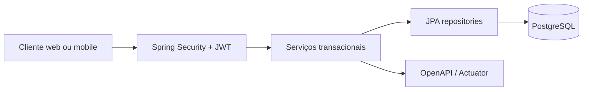

# MatchHub API

[](https://github.com/Kadys-dv/matchhub-api/actions/workflows/ci.yml)
[](#stack)
[](#stack)
[](#stack)
[](#executar-localmente)

API REST da plataforma PlayMatch para gerenciar usuários, partidas, participações, denúncias e indicadores administrativos com segurança, consistência transacional e regras de negócio no servidor.

## Links rápidos

- Estudo de caso: <https://kadys-dv.github.io/portfolio-rodrigo/projetos/matchhub-api.html>
- Repositório: <https://github.com/Kadys-dv/matchhub-api>
- Swagger local: <http://localhost:8080/swagger-ui.html>
- Health local: <http://localhost:8080/actuator/health>
- Arquitetura: [docs/ARCHITECTURE.md](docs/ARCHITECTURE.md)

## Objetivo

O PlayMatch precisa controlar operações sensíveis de partidas: cadastro, login, participação, desistências, lotação, denúncias, moderação e indicadores. Essas regras não podem depender apenas do aplicativo ou do painel web, porque clientes diferentes podem tentar executar ações concorrentes ou não autorizadas.

## Solução

A MatchHub API centraliza as regras críticas em um backend Java com autenticação, autorização, persistência relacional e transações. O frontend consome a API, mas a decisão final de segurança e consistência permanece no servidor.



## Funcionalidades

- Cadastro, login, BCrypt e autenticação JWT.
- Papéis `PLAYER` e `ADMIN` com autorização no servidor.
- Criação, participação, desistências, conclusão e cancelamento de partidas.
- Controle concorrente de vagas com bloqueio pessimista.
- Consulta de participantes confirmados.
- Gestão administrativa de contas ativas e desativadas.
- Denúncias com fila de moderação e resolução.
- Indicadores consolidados para dashboard administrativo.
- Migrations com Flyway, documentação OpenAPI, Actuator e Docker.
- Testes de integração cobrindo autenticação, partidas e administração.

## Stack

- Java 21
- Spring Boot 4.x
- Spring Security e OAuth2 Resource Server
- PostgreSQL
- Flyway
- JWT
- Docker e Docker Compose
- OpenAPI/Swagger
- Actuator
- JUnit, Spring Boot Test, H2 e JaCoCo

## Executar localmente

Copie `.env.example` para `.env`, gere um segredo Base64 seguro e configure `ADMIN_EMAIL` somente se desejar promover uma conta previamente cadastrada.

```powershell
docker compose up --build
```

Depois acesse:

- Swagger: <http://localhost:8080/swagger-ui.html>
- Saúde: <http://localhost:8080/actuator/health>

## Qualidade

```powershell
.\mvnw.cmd test
.\mvnw.cmd verify
```

`mvnw verify` também gera o relatório JaCoCo em `target/site/jacoco/index.html`. O workflow de CI executa `./mvnw --batch-mode verify` e publica o relatório de cobertura como artefato.

## Segurança

- O controle de autorização é aplicado pela API; o frontend nunca é considerado fronteira de segurança.
- Senhas são persistidas com BCrypt.
- Credenciais de banco, segredo JWT e e-mail administrativo devem ficar apenas em variáveis de ambiente.
- `.env.example` documenta a configuração sem versionar segredos.

## Publicação

O arquivo `render.yaml` deixa a API pronta para publicação no Render usando o Dockerfile do projeto. No painel do Render, informe as credenciais do Neon sem gravá-las no repositório:

- `DATABASE_URL`: URL JDBC no formato `jdbc:postgresql://HOST/BANCO?sslmode=require`;
- `DATABASE_USER`: usuário fornecido pelo Neon;
- `DATABASE_PASSWORD`: senha fornecida pelo Neon;
- `JWT_SECRET`: gerado automaticamente pelo Render;
- `ADMIN_EMAIL`: e-mail da conta que receberá o papel administrativo após o cadastro.

O plano gratuito pode suspender a API durante inatividade, portanto a primeira requisição pode demorar mais. Para uso comercial com disponibilidade contínua, use um plano sem suspensão.

Desenvolvido por Dev Rodrigo. Todos os direitos reservados.
