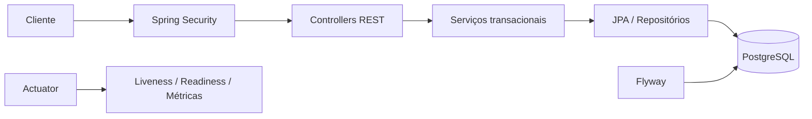

# Arquitetura da MatchHub API

JWT autentica a identidade e os papéis são verificados no servidor. Criação, entrada, saída, conclusão e moderação passam pela camada de serviços. O bloqueio de partida protege a última vaga contra concorrência.
